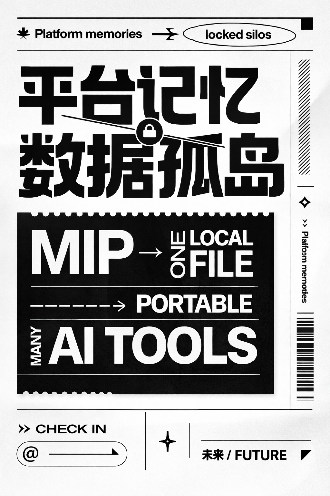

# MIP: Memory Interoperability Protocol

<p align="center">
  <strong>A portable, user-owned <code>memory.json</code> standard any AI app can read.</strong>
</p>

<p align="center">
  <a href="./README.zh-CN.md">Simplified Chinese</a> | English
</p>

<p align="center">
  
</p>
---

## Why MIP exists

AI tools are getting better at remembering you.

That memory is usually trapped inside each product.

You teach ChatGPT your preferences. Switch to Claude or a local agent, and you start over. Switch back three months later, and the old product may remember an outdated version of you.

MIP is a small open convention that fixes the portability layer:

> Keep one local file at `~/.mip/memory.json`. Any AI product can read it to understand you.

No daemon. No hosted service. No database. Just a file.

## What MIP is

MIP v0.1 is a minimal standard for explicit user memory:

- identity
- preferences
- custom user-defined fields

It is intentionally small. The goal is not to solve all memory problems in v0.1. The goal is to create a stable portability baseline that tools can adopt quickly.

## What MIP is not

- Not a memory product like Mem0 or Letta
- Not a hosted profile sync service
- Not a replacement for tool-specific rules like `.cursorrules` or `CLAUDE.md`

Those are implementations or product-specific conventions. MIP is the shared format.

## Quick example

```jsonc
// ~/.mip/memory.json
{
  "$schema": "https://mip-protocol.org/v0.1/schema.json",
  "version": "0.1.0",
  "identity": {
    "name": "Jane",
    "language": "en-US",
    "role": "Frontend Engineer",
    "tech_stack": ["React", "TypeScript", "Next.js"]
  },
  "preferences": {
    "response_style": "concise",
    "formality": "casual",
    "code_comments_language": "zh-CN",
    "variable_names_language": "en"
  },
  "custom": {
    "editor": "VS Code",
    "interests": ["AI", "Web3", "Design"]
  }
}
```

## Read it in 3 lines

**Python**

```python
import json, pathlib
path = pathlib.Path.home() / ".mip" / "memory.json"
memory = json.loads(path.read_text()) if path.exists() else {}
```

**JavaScript**

```javascript
import { readFileSync, existsSync } from "fs";
import { homedir } from "os";
const path = `${homedir()}/.mip/memory.json`;
const memory = existsSync(path) ? JSON.parse(readFileSync(path, "utf-8")) : {};
```

## Why this matters

- User-owned: your memory lives on your machine, not only inside one vendor
- Portable: multiple AI tools can read the same profile
- Simple: adoption cost is extremely low
- Forward-compatible: future versions can add richer memory layers without breaking v0.1

Think of it as `.editorconfig` for AI memory.

## Adoption paths

The easiest tools to support MIP are:

1. IDE agents and local coding tools
2. Open-source AI clients
3. MCP-enabled apps
4. Local model runtimes and wrappers

These tools already run on your machine and can read local files with almost no integration cost.

## MIP and MCP

MCP and MIP solve different problems:

- MCP answers: what tools can the AI use?
- MIP answers: who is the user?

MIP can work without MCP. For MCP-enabled apps, MIP can also be exposed through the included proof-of-concept server in [mcp-server/](./mcp-server/).

```json
{
  "mcpServers": {
    "mip": {
      "command": "node",
      "args": ["path/to/mip-server/index.js"]
    }
  }
}
```

## Repository contents

- [RFC-0001-MIP.md](./RFC-0001-MIP.md): MVP specification
- [RFC-0001-MIP-full-vision.md](./RFC-0001-MIP-full-vision.md): long-term vision
- [schemas/memory.schema.json](./schemas/memory.schema.json): JSON Schema
- [examples/memory.json](./examples/memory.json): example file
- [examples/memory.template.json](./examples/memory.template.json): starter template for real local use
- [mcp-server/](./mcp-server/): MCP proof of concept
- [docs/maintenance-rules.md](./docs/maintenance-rules.md): current writeback policy and memory maintenance rules
- [docs/decisions/](./docs/decisions/): public design decisions and tradeoffs
- [docs/evolution/](./docs/evolution/): public evolution notes and framing changes
- [docs/research/](./docs/research/): public research notes and platform capability mapping
- [schemas/memory.writeback.extension.schema.json](./schemas/memory.writeback.extension.schema.json): experimental governed-writeback schema draft
- [examples/memory.writeback-extension.json](./examples/memory.writeback-extension.json): example file for the Route 2 draft
- [examples/suggestion.observation.json](./examples/suggestion.observation.json): example output for the first `mip suggest` workflow
- [examples/suggestion.bundle.json](./examples/suggestion.bundle.json): example review bundle for multiple suggestions

## Local workflow

If you want to use MIP with project-aware AI tools today, keep one source of truth in `~/.mip/memory.json`, then generate a project-level context file:

```powershell
node .\scripts\build-context.mjs
```

That command writes `MIP-CONTEXT.md` in the current project.

### Check mode

Before writing into an existing project, you can inspect the current `AGENTS.md` for likely overlap or conflict signals:

```powershell
node .\scripts\mip.mjs check codex
```

This does not make decisions for you. It reports whether `AGENTS.md` exists, whether current or legacy MIP blocks are present, and whether obvious exclusive or overlapping rule phrases were detected.

### Codex workflow

Codex is the first validated Route 1 target in this repository.
Use the CLI entrypoint to initialize or sync a project:

```powershell
node .\scripts\mip.mjs init codex
```

To regenerate `MIP-CONTEXT.md` without changing `AGENTS.md`:

```powershell
node .\scripts\mip.mjs sync codex
```

You can also point the command at a template or alternate source:

```powershell
node .\scripts\mip.mjs init codex --input .\examples\memory.template.json --cwd .
```

If a project already has an `AGENTS.md`, the script preserves existing content and only updates the explicit `MIP User Context Source Of Truth` block. Legacy MIP markers are upgraded automatically when touched by the current tooling.

### Antigravity workflow

Antigravity support is currently experimental.
It reuses the same project-local `AGENTS.md` + `MIP-CONTEXT.md` pattern that was observed to work in local testing:

```powershell
node .\scripts\mip.mjs init antigravity
```

To regenerate `MIP-CONTEXT.md` only:

```powershell
node .\scripts\mip.mjs sync antigravity
```

### Suggest mode

Route 2 now includes a minimal suggestion generator that writes candidate updates into `.mip-suggestions/` instead of mutating `memory.json` directly:

```powershell
node .\scripts\mip.mjs suggest observation --key communication_style --value direct --source conversation_pattern --confidence 0.78
```

### Review bundle mode

When there are multiple suggestion files, you can bundle them into one review artifact:

```powershell
node .\scripts\mip.mjs pack suggestions
```

Then print a grouped human-readable summary before any future apply step:

```powershell
node .\scripts\mip.mjs review bundle
```

You can also render the review as Markdown and write it to a file:

```powershell
node .\scripts\mip.mjs review bundle --format markdown --output .\review.md
```

## Roadmap

| Version | Focus |
|---|---|
| **v0.1** | Single local file, explicit user memory, read-mostly |
| v0.2 | Behavioral patterns layer |
| v0.3 | Permissions and visibility controls |
| v0.4 | Local runtime daemon |
| v0.5 | Encrypted cross-device sync |
| v1.0 | Full specification |

## Contributing

MIP is early. The best contributions right now are:

- Implement read support in AI tools
- Review the RFC and schema
- Build adapters for MCP clients
- Challenge the model and point out edge cases

Open an [issue](https://github.com/UnCooe/MIP/issues) if you want to discuss adoption, semantics, or implementation details.

## License

[CC-BY-SA 4.0](./LICENSE)


